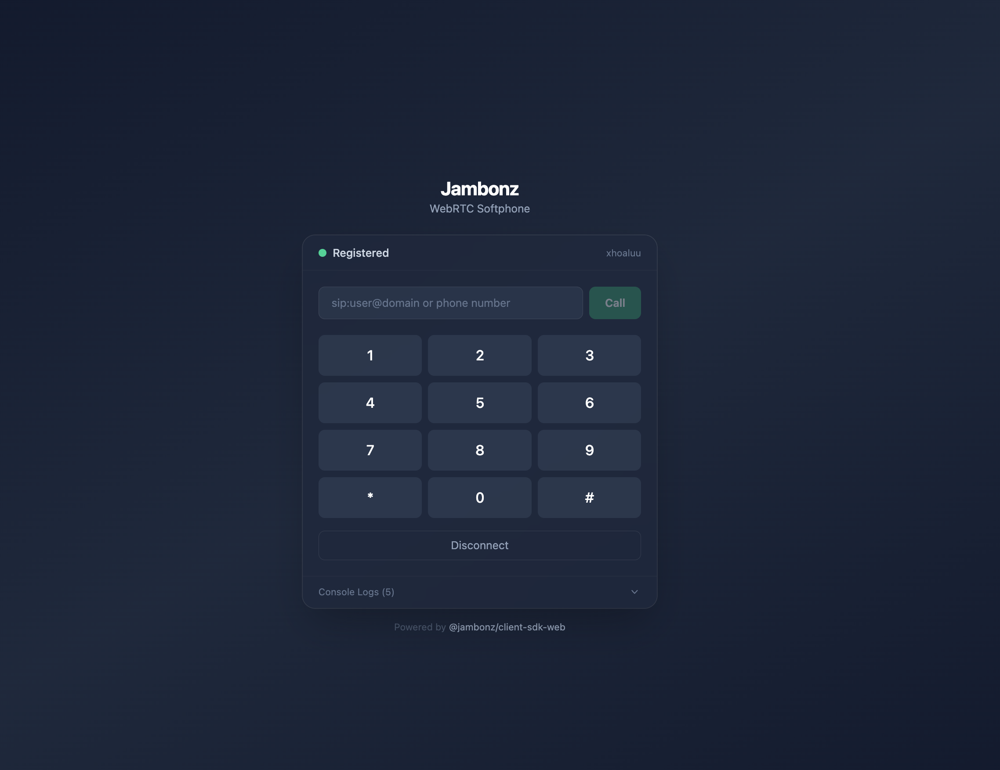

# Jambonz WebRTC SDK

Voice calling SDK for [Jambonz](https://jambonz.org) CPaaS — supports **Web (React)** and **React Native (iOS + Android)**.

Uses SIP over WebSocket for signaling via JsSIP (hidden from consumers). Provides a simple, typed API for making and receiving voice calls.

<p align="center">
  
</p>

<p align="center">
  
  
  
</p>

## Packages

| Package | Description | npm |
|---------|-------------|-----|
| `@jambonz/client-sdk-core` | Shared logic — JambonzClient, JambonzCall, events, types | [](https://www.npmjs.com/package/@jambonz/client-sdk-core) |
| `@jambonz/client-sdk-web` | Browser adapter — WebRTC + WebSocket + HTMLAudioElement | [](https://www.npmjs.com/package/@jambonz/client-sdk-web) |
| `@jambonz/client-sdk-react-native` | React Native adapter — uses `react-native-webrtc` | [](https://www.npmjs.com/package/@jambonz/client-sdk-react-native) |

## Quick Start

### Web (React)

```bash
npm install @jambonz/client-sdk-web
```

```tsx
import { createJambonzClient } from '@jambonz/client-sdk-web';

// Connect to Jambonz SBC
const client = createJambonzClient({
  server: 'wss://sbc.jambonz.org:8443',
  username: 'user1',
  password: 'pass123',
});

await client.connect();
console.log('Registered!');

// Make a call (phone number or SIP URI)
const call = client.call('+1234567890');
call.on('accepted', () => console.log('Call connected'));
call.on('ended', () => console.log('Call ended'));

// Call another registered user
const call = client.callUser('alice');

// Take a call from a queue
const call = client.callQueue('support');

// Join a conference room
const call = client.callConference('standup-meeting');

// Call a Jambonz application
const call = client.callApplication('app-sid-123');

// In-call controls
call.toggleMute();
call.hold();
call.unhold();
call.sendDTMF('1');
call.transfer('sip:other@domain');
call.hangup();

// Receive incoming calls
client.on('incoming', (call) => {
  call.answer();  // or call.hangup() to decline
});

// Disconnect
client.disconnect();
```

### React Native (iOS + Android)

```bash
npm install @jambonz/client-sdk-react-native react-native-webrtc
```

```tsx
import { createJambonzClient } from '@jambonz/client-sdk-react-native';

// Same API as web — just a different import
const client = createJambonzClient({
  server: 'wss://sbc.jambonz.org:8443',
  username: 'user1',
  password: 'pass123',
});

await client.connect();
const call = client.call('+1234567890');
```

### React Hooks

Both packages export React hooks for declarative integration:

```tsx
import { useJambonzClient, useCall } from '@jambonz/client-sdk-web';
// or from '@jambonz/client-sdk-react-native'

function Phone() {
  const { state, isRegistered, connect, disconnect, error } = useJambonzClient({
    server: 'wss://sbc.jambonz.org:8443',
    username: 'user1',
    password: 'pass123',
  });

  const {
    call, state: callState, isMuted, isHeld, isActive,
    makeCall, hangup, toggleMute, toggleHold, sendDtmf,
    incomingCaller, answerIncoming, declineIncoming,
  } = useCall(client);

  return (
    <div>
      <p>Status: {state}</p>
      <button onClick={connect}>Connect</button>
      <button onClick={() => makeCall('+1234567890')}>Call</button>
    </div>
  );
}
```

## Call Types

The SDK supports four types of outbound calls, matching Jambonz SBC routing conventions:

| Method | Target | Use Case |
|--------|--------|----------|
| `client.call(number)` | Phone number or SIP URI | Call a PSTN number or SIP endpoint |
| `client.callUser(username)` | Registered SIP user | Call another user registered on the same SBC |
| `client.callQueue(queueName)` | Named queue | Take a call from a Jambonz queue |
| `client.callConference(name)` | Conference room | Join a Jambonz conference room |
| `client.callApplication(sid)` | Application SID | Route call to a specific Jambonz application |

```ts
// Call a phone number
const call = client.call('+15551234567');

// Call another registered user
const call = client.callUser('alice');

// Take a call from the "support" queue
const call = client.callQueue('support');

// Join the "standup" conference room
const call = client.callConference('standup');

// Call a Jambonz application by its SID
const call = client.callApplication('abc-123-def-456');
```

All call type methods accept the same optional `JambonzCallOptions` (custom headers, timeout, recording, codec preference).

## Features

- **SIP registration** — auto-register on connect
- **Outbound & inbound calls** — make and receive voice calls
- **4 call types** — call users, queues, conferences, and applications
- **Call control** — answer, hangup, hold/unhold, mute/unmute, DTMF
- **Call transfer** — blind (`call.transfer(target)`) and attended (`call.attendedTransfer(otherCall)`)
- **Noise isolation** — `call.enableNoiseIsolation()` / `call.disableNoiseIsolation()` (server-side)
- **Call quality metrics** — `call.getStats()` and `call.startQualityMonitoring()`
- **Audio device management** — enumerate mics/speakers, switch output device
- **Codec preference** — `client.call(target, { preferredCodecs: ['opus'] })`
- **No-answer timeout** — `client.call(target, { noAnswerTimeout: 30 })`
- **Call recording** — `client.call(target, { record: true })`
- **Conference calling** — `client.conference(target, roomId)`
- **SIP messaging** — `client.sendMessage(target, body)`
- **Multiple simultaneous calls** — `client.calls`, `client.callCount`
- **Auto-reconnection** — reconnects on transient WebSocket drops
- **Custom SIP headers** — on REGISTER and INVITE
- **Custom User-Agent** — configurable via options
- **Ringtone/ringback** — auto-plays ringback tone on outgoing calls
- **React hooks** — `useJambonzClient()`, `useCall()`
- **TypeScript** — full strict mode, named exports only
- **Integration tests** — 68 Playwright tests against real SBC

## API Reference

### JambonzClient

```ts
const client = createJambonzClient(options);

// Options
interface JambonzClientOptions {
  server: string;           // WebSocket URL (wss://...)
  username: string;         // SIP username
  password: string;         // SIP password
  displayName?: string;     // Display name for callee
  realm?: string;           // SIP realm (defaults to server hostname)
  autoRegister?: boolean;   // Auto-register on connect (default: true)
  registerExpires?: number; // Registration expiry in seconds (default: 300)
  userAgent?: string;       // Custom User-Agent header
}

// Methods
await client.connect();
client.disconnect();
client.register();
client.unregister();
const call = client.call(target, options?);
const call = client.callUser(username, options?);
const call = client.callQueue(queueName, options?);
const call = client.callConference(conferenceName, options?);
const call = client.callApplication(applicationSid, options?);
client.sendMessage(target, body, contentType?);

// Properties
client.state;        // ClientState enum
client.isRegistered; // boolean
client.calls;        // ReadonlyMap<string, JambonzCall>
client.callCount;    // number

// Events
client.on('registered', () => {});
client.on('unregistered', () => {});
client.on('registrationFailed', (error) => {});
client.on('incoming', (call) => {});
client.on('stateChanged', (state) => {});
client.on('connected', () => {});
client.on('disconnected', () => {});
client.on('message', ({ from, body, contentType }) => {});
client.on('error', (error) => {});
```

### JambonzCall

```ts
// Methods
call.answer();
call.hangup();
call.hold();
call.unhold();
call.mute();
call.unmute();
call.toggleMute();
call.sendDTMF(tone);
call.enableNoiseIsolation(opts?);  // { vendor?, level?, model? }
call.disableNoiseIsolation();
call.transfer(target, options?);
call.attendedTransfer(otherCall, options?);
await call.getStats();
call.startQualityMonitoring(intervalMs?);
call.stopQualityMonitoring();

// Properties
call.id;              // string
call.state;           // CallState enum
call.direction;       // 'inbound' | 'outbound'
call.isMuted;         // boolean
call.isHeld;          // boolean
call.duration;        // seconds
call.remoteIdentity;  // string

// Events
call.on('accepted', () => {});
call.on('progress', () => {});
call.on('ended', (cause) => {});
call.on('failed', (cause) => {});
call.on('stateChanged', (state) => {});
call.on('hold', (held) => {});
call.on('mute', (muted) => {});
call.on('dtmf', (tone) => {});
call.on('transferred', () => {});
call.on('transferFailed', (error) => {});
call.on('qualityStats', (stats) => {});
```

### Call Options

```ts
client.call(target, {
  headers: { 'X-Custom': 'value' },      // Custom SIP headers
  mediaConstraints: { audio: true },       // getUserMedia constraints
  pcConfig: { iceServers: [...] },         // ICE/STUN/TURN config
  noAnswerTimeout: 30,                     // Auto-hangup after 30s
  preferredCodecs: ['opus', 'PCMU'],       // Codec priority
  record: true,                            // Server-side recording
});
```

## AI-Assisted Development

The `@jambonz/webrtc-mcp-server` package is an [MCP (Model Context Protocol)](https://modelcontextprotocol.io) server that gives AI coding assistants — Claude, Cursor, GitHub Copilot, Windsurf, and others — deep knowledge of the jambonz WebRTC SDK APIs, events, and usage patterns. This means the AI can generate correct softphone application code without you having to manually explain the API.

### What it provides

The MCP server exposes two tools to the AI:

1. **`jambonz_developer_toolkit`** — A comprehensive developer guide covering the SDK API, call types, events, React hooks, and working code examples.
2. **`get_jambonz_schema`** — Full JSON Schema for any SDK type (`client-options`, `call-options`, `client-events`, `call-events`, `component:audio-device`, etc.).

When you ask the AI to build a softphone or WebRTC application, it calls these tools automatically to get the context it needs.

### Setup

Choose the setup that matches your development environment. You only need one.

#### Option A: Remote server (no install needed)

A hosted instance is available at `https://webrtc-mcp-server.jambonz.app/mcp`. This is the simplest option — no local install or npx required.

**Claude Code (CLI)**

```bash
# Project-level
claude mcp add jambonz-webrtc -t streamable-http https://webrtc-mcp-server.jambonz.app/mcp

# Global
claude mcp add --scope user jambonz-webrtc -t streamable-http https://webrtc-mcp-server.jambonz.app/mcp
```

Or add to your project's `.mcp.json`:

```json
{
  "mcpServers": {
    "jambonz-webrtc": {
      "type": "streamable-http",
      "url": "https://webrtc-mcp-server.jambonz.app/mcp"
    }
  }
}
```

**Cursor** — add to `.cursor/mcp.json`:

```json
{
  "mcpServers": {
    "jambonz-webrtc": {
      "url": "https://webrtc-mcp-server.jambonz.app/mcp"
    }
  }
}
```

**VS Code (GitHub Copilot / Claude Extension)** — add to `.vscode/mcp.json`:

```json
{
  "servers": {
    "jambonz-webrtc": {
      "type": "http",
      "url": "https://webrtc-mcp-server.jambonz.app/mcp"
    }
  }
}
```

**Windsurf** — open **Windsurf Settings > MCP** and add:

```json
{
  "mcpServers": {
    "jambonz-webrtc": {
      "serverUrl": "https://webrtc-mcp-server.jambonz.app/mcp"
    }
  }
}
```

#### Option B: Local via npx

Run the MCP server locally using npx. This uses stdio transport and requires no network access.

**Claude Code (CLI)**

```bash
# Project-level
claude mcp add jambonz-webrtc -- npx -y @jambonz/webrtc-mcp-server

# Global
claude mcp add --scope user jambonz-webrtc -- npx -y @jambonz/webrtc-mcp-server
```

Or add to your project's `.mcp.json`:

```json
{
  "mcpServers": {
    "jambonz-webrtc": {
      "command": "npx",
      "args": ["-y", "@jambonz/webrtc-mcp-server"]
    }
  }
}
```

**Claude Desktop** — open **Settings > Developer > Edit Config** and add to `mcpServers`:

```json
{
  "mcpServers": {
    "jambonz-webrtc": {
      "command": "npx",
      "args": ["-y", "@jambonz/webrtc-mcp-server"]
    }
  }
}
```

**Cursor** — add to `.cursor/mcp.json`:

```json
{
  "mcpServers": {
    "jambonz-webrtc": {
      "command": "npx",
      "args": ["-y", "@jambonz/webrtc-mcp-server"]
    }
  }
}
```

**VS Code (GitHub Copilot / Claude Extension)** — add to `.vscode/mcp.json`:

```json
{
  "servers": {
    "jambonz-webrtc": {
      "command": "npx",
      "args": ["-y", "@jambonz/webrtc-mcp-server"]
    }
  }
}
```

**Windsurf** — open **Windsurf Settings > MCP** and add:

```json
{
  "mcpServers": {
    "jambonz-webrtc": {
      "command": "npx",
      "args": ["-y", "@jambonz/webrtc-mcp-server"]
    }
  }
}
```

### Verifying it works

After configuring the MCP server, start a new conversation with your AI assistant and ask it to build a softphone application. For example:

> "Create a React softphone app using @jambonz/client-sdk-web that can register, make outbound calls, and handle incoming calls."

The AI should automatically call the `jambonz_developer_toolkit` tool, then generate correct code using `createJambonzClient()`, proper event handling, and React hooks.

## Examples

| Example | Location | Run |
|---------|----------|-----|
| Web (React + Vite + Tailwind) | `examples/web/` | `cd examples/web && npm install && npm run dev` |
| React Native (iOS + Android) | `examples/react-native/` | See [React Native README](examples/react-native/README.md) |

## Development

```bash
# Install dependencies
npm install

# Build all packages
npm run build

# Format code
npm run format

# Run web integration tests (requires .env.test)
cp .env.test.example .env.test  # Fill in your SBC credentials
npm run test:web
```

## Publishing to npm

The SDK packages and MCP server are versioned and published independently. Each has its own GitHub Actions workflow triggered by a specific tag pattern.

### Publishing the SDK packages

```bash
./scripts/publish.sh          # patch bump (default)
./scripts/publish.sh minor    # minor bump
./scripts/publish.sh major    # major bump
```

The script bumps all three packages (`core`, `web`, `react-native`) to the same version, updates cross-dependencies, commits, tags with `v{version}`, and pushes. The `v*` tag triggers `.github/workflows/publish.yml`.

### Publishing `@jambonz/webrtc-mcp-server`

```bash
./scripts/publish-mcp.sh          # patch bump (default)
./scripts/publish-mcp.sh minor    # minor bump
./scripts/publish-mcp.sh major    # major bump
```

The script bumps the version, commits, tags with `mcp-v{version}`, and pushes. The `mcp-v*` tag triggers `.github/workflows/publish-mcp.yml`.

## Architecture

```
packages/
  core/           @jambonz/client-sdk-core       — shared logic, JsSIP wrapper
  web/            @jambonz/client-sdk-web         — browser platform adapter
  react-native/   @jambonz/client-sdk-react-native — React Native adapter
mcp-server/       @jambonz/webrtc-mcp-server     — MCP server for AI agents
schema/           JSON Schema definitions for the SDK API
examples/
  web/            React + Vite + Tailwind softphone demo
  react-native/   iOS + Android softphone demo
```

## License

MIT
