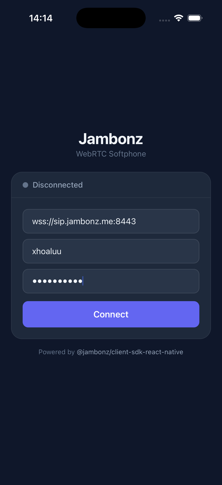
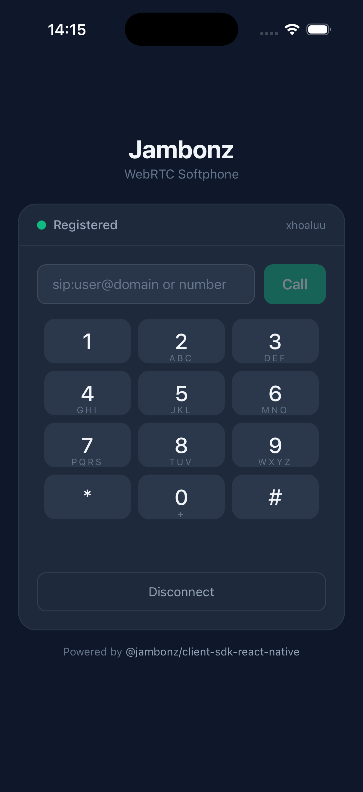
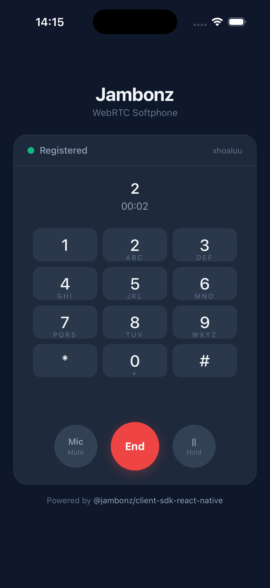

# Jambonz React Native Example

A softphone example app using `@jambonz/client-sdk-react-native` for both iOS and Android.

<p align="center">
  
  
  
</p>

## Prerequisites

- Node.js >= 18
- [React Native development environment](https://reactnative.dev/docs/set-up-your-environment)
- **Android**: Android Studio, Android SDK, JDK 17+, emulator or physical device
- **iOS**: Xcode 15+, CocoaPods, simulator or physical device (physical recommended for real calls)

## Setup

```bash
# From the monorepo root
cd /path/to/jambonz-webrtc-sdk

# 1. Install and build the SDK
npm install
npm run build

# 2. Install example dependencies
cd examples/react-native
npm install

# 3. Generate the native android/ and ios/ projects
npx @react-native-community/cli init JambonzExample --directory /tmp/JambonzExample --skip-install
cp -r /tmp/JambonzExample/android ./android
cp -r /tmp/JambonzExample/ios ./ios
rm -rf /tmp/JambonzExample
```

After generating, you need to add permissions:

**Android** — add to `android/app/src/main/AndroidManifest.xml` inside `<manifest>`:
```xml
<uses-permission android:name="android.permission.INTERNET" />
<uses-permission android:name="android.permission.ACCESS_NETWORK_STATE" />
<uses-permission android:name="android.permission.RECORD_AUDIO" />
<uses-permission android:name="android.permission.CAMERA" />
<uses-permission android:name="android.permission.MODIFY_AUDIO_SETTINGS" />
```

**iOS** — add to `ios/JambonzExample/Info.plist` before `</dict>`:
```xml
<key>NSMicrophoneUsageDescription</key>
<string>Required for voice calls</string>
```

## Android

### First-time setup

```bash
# Install JDK 17 if you don't have it
brew install --cask zulu@17
export JAVA_HOME=$(/usr/libexec/java_home -v 17)
```

### Run on a physical device

1. Enable **USB Debugging** on your phone (Settings → Developer Options)
2. Connect your phone via USB
3. Verify: `adb devices` should show your device

```bash
# Terminal 1: Start Metro
npx react-native start

# Terminal 2: Build and run
npx react-native run-android
```

### Permissions (already configured)

The following permissions are set in `android/app/src/main/AndroidManifest.xml`:

- `INTERNET` — WebSocket connection
- `ACCESS_NETWORK_STATE` — WebRTC network monitor
- `CAMERA` — required by react-native-webrtc
- `RECORD_AUDIO` — microphone access
- `MODIFY_AUDIO_SETTINGS` — audio routing

## iOS

### First-time setup

```bash
# Install CocoaPods if needed
brew install ruby  # Need Ruby 3.x for CocoaPods
gem install cocoapods

# Install native dependencies
cd ios && pod install && cd ..
```

### Configure signing in Xcode

```bash
open ios/JambonzExample.xcworkspace
```

1. Select the **JambonzExample** target
2. Go to **Signing & Capabilities** tab
3. Check **Automatically manage signing**
4. Select your **Team** (your Apple ID)
5. Change **Bundle Identifier** to something unique (e.g. `com.yourname.jambonzexample`)

### Run on a physical iPhone

1. Connect your iPhone via USB
2. Tap **Trust** on the phone when prompted
3. Enable **Developer Mode** (iOS 16+): Settings → Privacy & Security → Developer Mode

```bash
# Terminal 1: Start Metro
npx react-native start

# Terminal 2: Build and run on device
npx react-native run-ios --device

# Or press Play in Xcode with your iPhone selected
```

### Permissions (already configured)

The microphone permission is set in `ios/JambonzExample/Info.plist`:
- `NSMicrophoneUsageDescription` — "Required for voice calls"

### Troubleshooting

- **`pod install` fails**: Run `cd ios && pod install --repo-update && cd ..`
- **Signing fails**: Add your Apple ID in Xcode → Settings → Accounts
- **App crashes on call**: Ensure microphone permission is in Info.plist
- **"Communication with Apple failed"**: Your iPhone must be connected and visible in Xcode → Window → Devices and Simulators

## Usage

1. Enter your Jambonz SBC WebSocket URL, SIP username, and password
2. Tap **Connect** to register
3. Enter a number or SIP target and tap **Call**
4. Use the in-call controls: mute, hold, DTMF, hang up
5. Incoming calls show an answer/decline prompt

## Project Structure

```
src/
├── App.tsx              # Orchestrator — connects SDK to UI components
├── useJambonz.ts        # Hook wrapping all SDK calls (read this to learn the SDK)
├── theme.ts             # Color palette
└── components/
    ├── StatusDot.tsx     # Connection status indicator
    ├── ConnectionForm.tsx
    ├── DialerView.tsx
    ├── DtmfPad.tsx
    ├── ActiveCallView.tsx
    └── IncomingCallView.tsx
```

**To understand the SDK**, read these two files:
- **`useJambonz.ts`** — all SDK interactions (connect, call, mute, hold, transfer)
- **`App.tsx`** — how to wire SDK state to UI

## SDK Quick Reference

```tsx
import { createJambonzClient } from '@jambonz/client-sdk-react-native';

const client = createJambonzClient({ server, username, password });
await client.connect();

// Make a call
const call = client.call('+1234567890');
call.on('accepted', () => console.log('Connected'));

// Call controls
call.toggleMute();
call.hold();
call.unhold();
call.sendDTMF('1');
call.transfer('sip:other@domain');
call.hangup();

// Incoming calls
client.on('incoming', (call) => {
  call.answer();   // or call.hangup()
});

client.disconnect();
```
